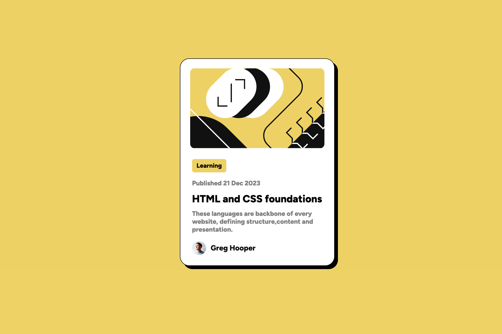
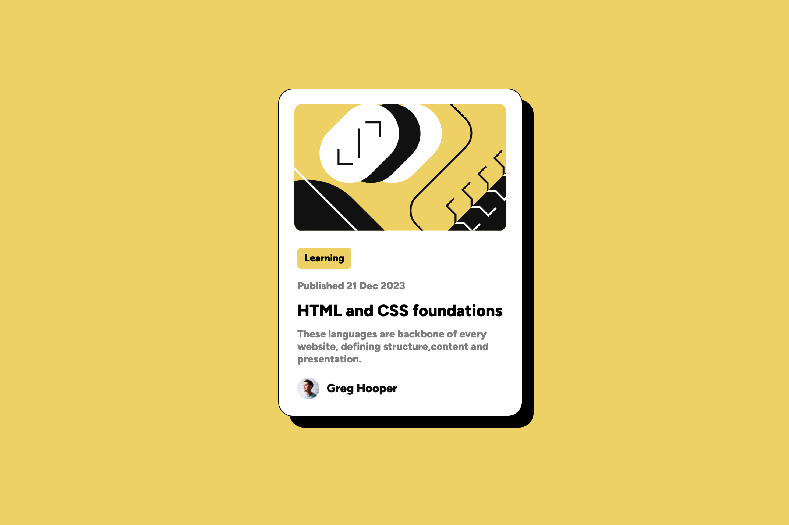
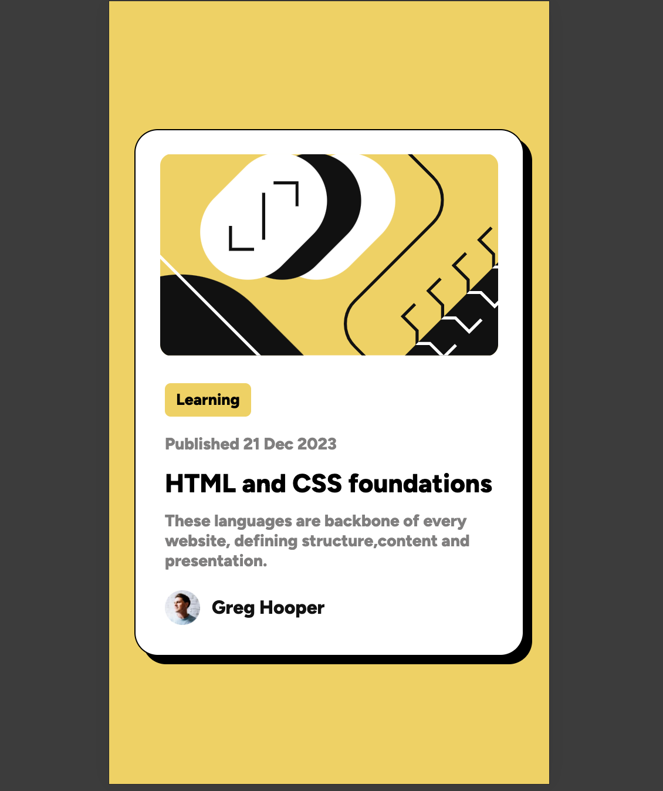

## Overview

### The challenge

Users should be able to:

- See hover and focus states for all interactive elements on the page

### Screenshot

#### Desktop-Design

#### Hover-Effect

#### Mobile Screen

### Links

- Solution URL: [GitHub](https://github.com/Kshitiz42069/frontend-mentor-Template)
- Live Site URL: [Live Link](https://kshitiz42069.github.io/frontend-mentor-Template/)

## My process

### Built with

- Semantic HTML5 markup
- CSS custom properties
- Flexbox

**Note: These are just examples. Delete this note and replace the list above with your own choices**

### What I learned

In this Assignment I learned about the Flex box and some Custom CSS.

## Author

- Frontend Mentor - [Kshitiz](https://www.frontendmentor.io/profile/Kshitiz42069)
- Twitter - [KshitizRai471](https://twitter.com/KshitizRai471)

